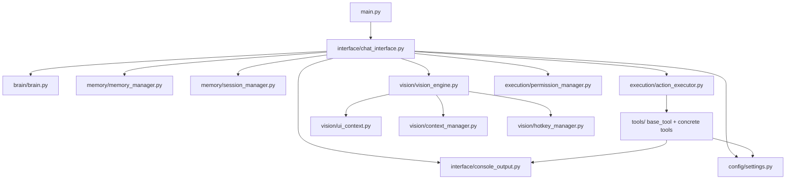
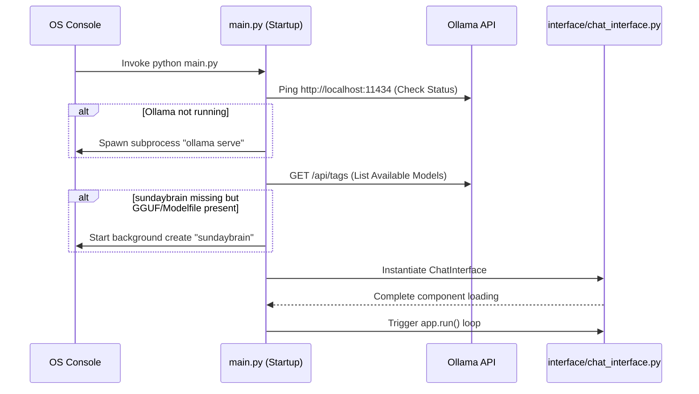
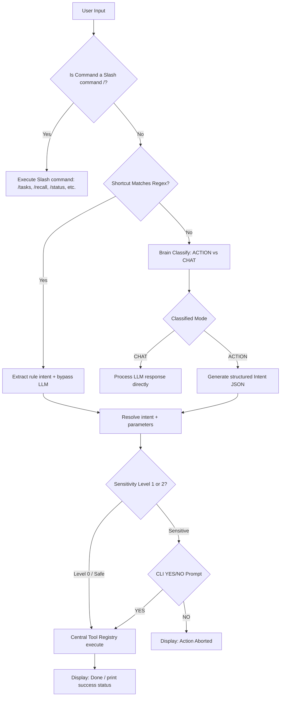

# SUNDAY System Architecture Documentation

This document provides a detailed overview of the modular system architecture of SUNDAY. By decoupling cognitive routing, persistent storage, visual automation, execution registries, and front-end displays, we establish a robust, maintainable, and highly extensible framework.

---

## 1. System Modular Tree & Dependencies

The system structure maps clear vertical responsibility tiers:

---

## 2. Startup Operational Flow

Upon invoking `python main.py`, SUNDAY executes the following sequential verification sequence:

---

## 3. Cognitive Routing & Execution Flow

When a user submits text inputs in the CLI loop, it routes dynamically through the LLM Brain classifier and the centralized Tool Registry:

---

## 4. Session State & Memory Manager Relationships

The persistent operational memory layers maintain distinct roles:

1. ** Factual Knowledge (`MemoryManager` -> `data/memory.json`)**:
   - Saves factual lessons on-demand via the `/learn` or `/remember` command.
   - Leverages Ollama in a background utility method to dynamically classify the topic headline.
   - Evaluates keyword matching and semantic queries via `/recall` and `/searchmemory`.

2. ** Active Session Tracking (`SessionManager` -> `data/session.json`)**:
   - Persists state dynamically (current working project, active goal description, open tasks lists, and rolling recent commands context history).
   - Generates condensed context header strings on every command turn:
     `[PROJECT: name] [GOAL: desc] [ACTIVE TASKS: task1, task2] [RECENT HISTORY: cmd1 -> cmd2]`
   - Injects this rolling context header directly into the LLM Brain system prompt to provide immediate context awareness.
