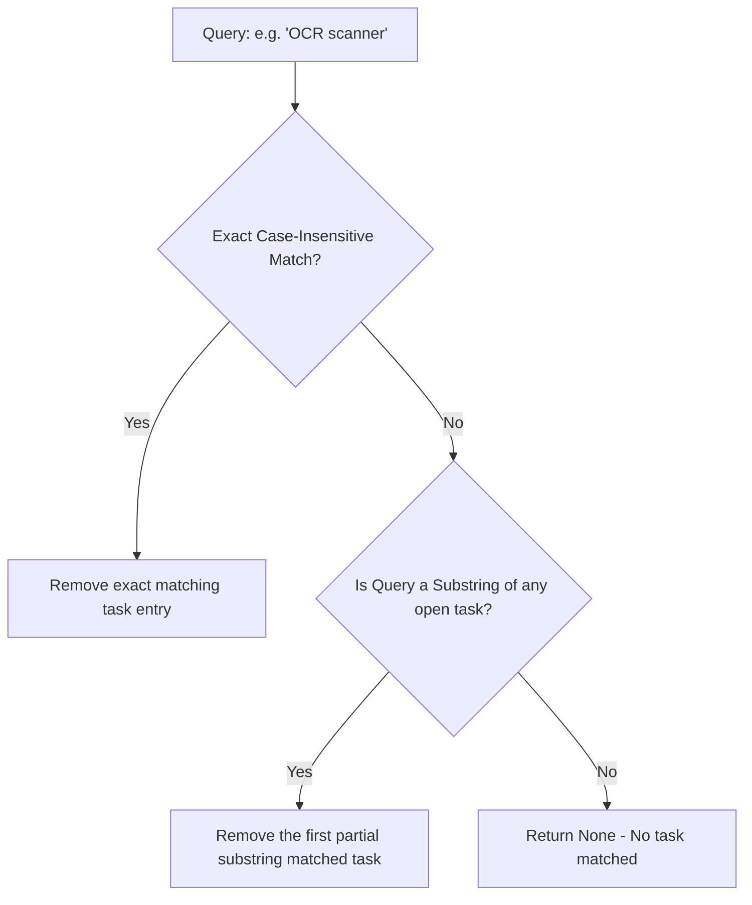

# SUNDAY Memory & Session Design

This document details the schema definitions, prompt injection designs, and data flows for SUNDAY's persistent knowledge and rolling session state subsystems.

---

## 1. Factual Knowledge Memory (`memory_manager.py`)

Factual knowledge is stored in an unstructured format but classified under distinct topics to enable fast and precise retrievals.

### Data Schema (`data/memory.json`)

```json
[
    {
        "topic": "Introducing Yourself",
        "content": "So whenever I ask to introduce yourself, just say hi, I am Sunday, a walking assistant for Dexo.",
        "timestamp": "2026-05-04T01:46:35.981699"
    },
    {
        "topic": "general_note",
        "content": "React components are reusable UI blocks for building web interfaces.",
        "timestamp": "2026-06-01T04:13:37.615600"
    }
]
```

### Topic Extraction Flow

When a fact is saved via `/learn <content>`, SUNDAY leverages Ollama to automatically classify the statement into a 2-4 word index topic:

1. **Prompt Structure**:
   ```text
   Extract a short 2-4 word topic title for the following text. Do not include any other words or punctuation.

   Text: {content}
   ```
2. **Execution**: Post request routed to Ollama `http://localhost:11434/api/generate` at low temperature (0.0).
3. **Failsafe**: If the Ollama server connection fails or times out, the topic defaults to `"general_note"`.

### Search & Retrieval Operations

- **Precision Recall (`/recall <topic>`)**: Searches the database for entries where the queried topic matches or forms a partial case-insensitive substring of the entry's topic key.
- **Global Search (`/searchmemory <query>`)**: Performs a full-text substring match across both the `content` and `topic` fields, returning all matching records.

---

## 2. Active Session State (`session_manager.py`)

The active session manager serializes the rolling execution state of SUNDAY, providing persistent "project" memory across assistant reboots.

### Data Schema (`data/session.json`)

```json
{
    "current_project": "SUNDAY Text-First Agent Rebuild",
    "active_goal": "Achieve full stability and modularity",
    "open_tasks": [
        "Verify session manager functionality",
        "Upgrade active visual OCR scanner"
    ],
    "recent_context": [
        "search ollama",
        "take screenshot",
        "/tasks",
        "explain this code"
    ],
    "last_action": "take_screenshot",
    "last_session_time": "2026-06-01T04:30:20.123456"
}
```

### Fuzzy Task Matching

To complete tasks smoothly via CLI, the `SessionManager` utilizes a two-tier case-insensitive fuzzy matching sequence:



---

## 3. Rolling Prompt Context Injection

To keep the LLM completely aware of the user's ongoing work, the active session is condensed into a tight context string on every turn:

`[PROJECT: current_project] [GOAL: active_goal] [ACTIVE TASKS: task1, task2] [RECENT HISTORY: cmd1 -> cmd2]`

This condensed string is dynamically injected into the Brain system prompt under `project_memory` on every turn, allowing the LLM to understand the context of conversational replies and action generations.
