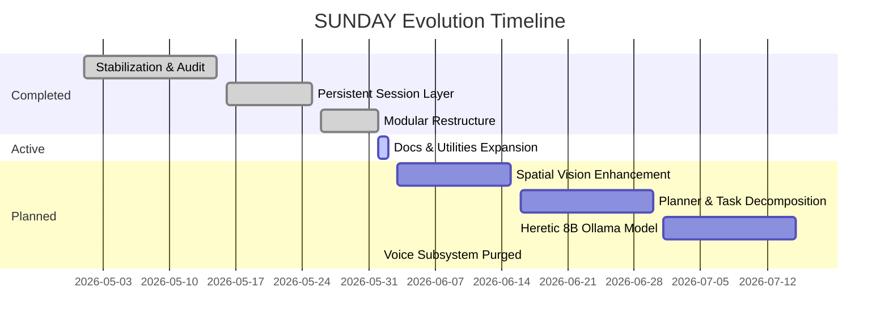

# SUNDAY Product & Capability Roadmap

This document outlines completed milestones, our active progress, and future developmental targets as SUNDAY evolves from a text-first console assistant into an intelligent, visually aware autonomous agent.

---

## 1. Milestone Overview

---

## 2. Milestone Details

### ✅ Phase 1: Stabilization & Audits (Completed)
- Decoupled and removed Voice/Audio dependency layers to guarantee 100% text-first operational speeds.
- Established circular dependency checks and startup validation diagnostics.
- Introduced standard `/recall` and `/searchmemory` factual recall commands.

### ✅ Phase 2: Professional Modular Refactor (Completed)
- Organized scripts into dedicated packages: `config/`, `brain/`, `memory/`, `vision/`, `execution/`, and `interface/`.
- Factored all 14 automation operations out into modular tools under `tools/`.
- Completely removed legacy speech/transcription stubs and dependencies to establish a text-only core.
- Migrated state serialization files to a centralized database directory `data/`.

### 🚀 Phase 3: Spatial Vision System Enhancement (Next Milestone)
- Upgrade UIA descendant layout coordinate tracking to support dynamic screen OCR parsing.
- Refine active window crops and multi-monitor fallback engines.
- Introduce selective region coordinate OCR bounded scans without triggering active visual loops or continuous tracking.

### 📅 Phase 4: Agent Planning Layer (Planner)
- Build task decomposition and execution loops inside `planner/planner.py`.
- Formulate multi-step task execution chains (e.g. decomposing "create a workout plan and store it" into step-by-step vision, text, and memory operations).
- Implement tool self-selection and progress reporting boards.

### 📅 Phase 5: Heretic 8B Model Integration
- Support high-speed local inference utilizing quantized Heretic GGUF models.
- Set up custom Ollama Modelfiles incorporating system prompts optimized for tool registries and self-repairing JSON structures.

### 📅 Phase 6: Advanced Automation Workflows
- Build cross-application text extraction pipelines.
- Standardize multi-browser visual awareness interfaces.

> [!NOTE]
> The Voice Subsystem has been completely removed from SUNDAY to optimize performance and ensure a 100% text-first offline architecture. No dormant voice code or dependencies remain in the repository.
