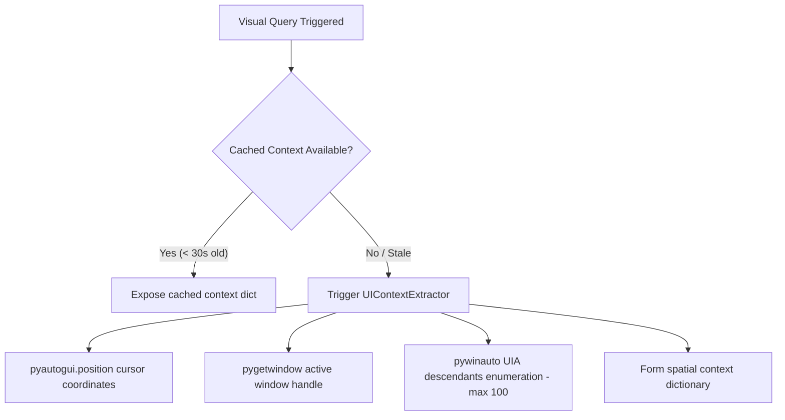

# SUNDAY Spatial Vision Design

This document details the spatial screen context awareness, selective region OCR, window crop screenshot pipelines, and caching designs for SUNDAY's visual subsystem.

---

## 1. Core Vision Capabilities

The vision engine operates strictly on an **on-demand, pull-based model**. It does not perform continuous monitor capture or background recording, ensuring high privacy compliance, low CPU/RAM footprint, and zero execution latency.



---

## 2. Spatial Context Layout Schema

The UIA descendant scan produces a structured coordinates element dict cached in the active `VisionSession`:

```json
{
  "app": "Microsoft Edge",
  "title": "GitHub - Sunday Restructure",
  "mouse": [1280, 540],
  "summary": "App: Microsoft Edge | Title: GitHub - Sunday Restructure | Cursor: [1280, 540] | Focused: None | Active Layout: 'Minimize' [Button] bbox [1749, 0, 57, 38]; 'GitHub' [Link] bbox [200, 20, 80, 24]",
  "important_text": "GitHub Sunday Restructure Minimize Close",
  "elements": [
    {
      "type": "Button",
      "name": "Minimize",
      "bbox": [1749, 0, 57, 38],
      "focused": false
    }
  ]
}
```

This structured UIA `summary` is injected into the Action Brain system prompt to provide immediate coordinate layout awareness for mouse clicking actions.

---

## 3. Targeted OCR Region Processing

When coordinate region OCR is requested via `/vision region <x> <y> <w> <h>`:

1. **Selective Monitor Crop**: Leverages Pillow `ImageGrab.grab(bbox)` to crop only the requested bounding box region `(x, y, x + w, y + h)`.
2. **Pre-processing Image Optimizations**:
   - Converts the crop to a clean grayscale layout using `ImageOps.grayscale`.
   - Upscales the crop dynamically by 200% (`width * 2, height * 2`) using bicubic filtering to sharpen character edges.
3. **Robust Text Extraction**: Passes the optimized image to `pytesseract`'s `image_to_string`, returning high-accuracy character parsings.

---

## 4. Window-Aware Screenshots

When standard full screenshots are captured:

- **Target Window Identification**: Leverages PyGetWindow to locate applications by title string matching (e.g., `"Notepad"`).
- **Exact Crop Boundaries**: Fetches the bounding coordinates `(left, top, right, bottom)` of the application's actual window wrapper.
- **Atomic Desktop Exports**: Crops Pyautogui grabs perfectly to the window shape and exports it directly to the user's primary desktop path under the central standard:
  `SUNDAY_Window_Capture_YYYYMMDD_HHMMSS.png`

---

## 5. Visual Context Caching Parameters

To prevent visual context blocking and save system overhead:

- **Cache Lifetime**: 30 seconds (`duration = 30`). A background thread caches context in memory and terminates.
- **Poll Interval**: 6 seconds (`poll_interval = 6`). Queries descendants periodically during active sessions.
- **Privacy Application Blacklist**: Scans are aborted instantly if the active window matches blacklisted security managers:
  `BLACKLISTED_APPS = {"Bitwarden", "KeePass", "Windows Security"}`
